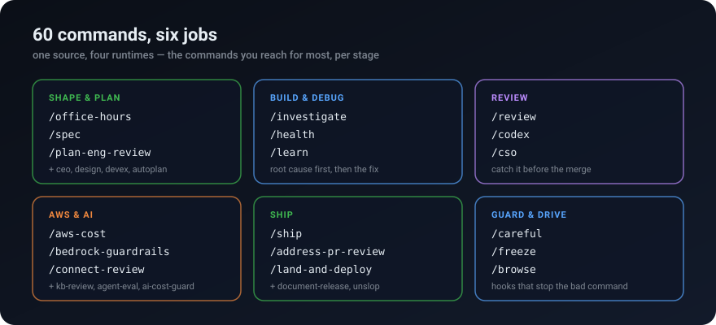
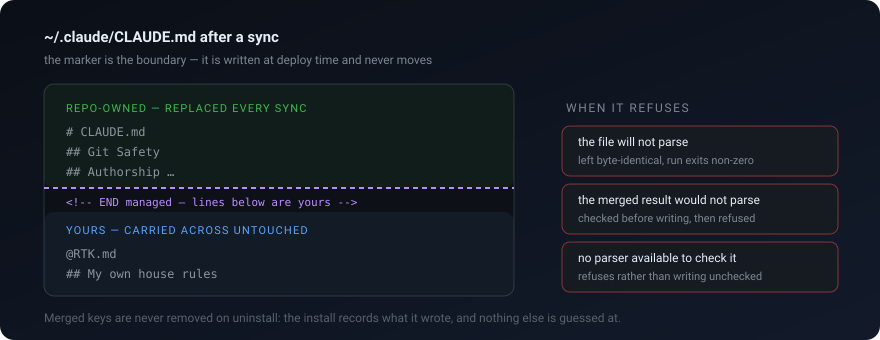

# vibestack

<p align="center">
  
</p>

<p align="center">
  <b>Your assistant already writes code. This teaches it how a senior engineer works.</b>
</p>

---

## What is vibestack?

Sixty workflows for AI coding assistants, each a file your agent reads and exposes
as a command. You type `/review` instead of "check my code," and a structured
process runs: read the diff, look for the things that actually break, report with
evidence. Same for planning, debugging, security, shipping.

It also installs the standing rules those workflows assume — plan before coding,
never commit without being asked, write commits in the author's voice — so the
assistant behaves that way between commands too.

Works in Claude Code, Cursor, Kiro and Codex CLI from one source. MIT, no
telemetry, no account, nothing leaves your machine.

| What you get | Why it matters |
|---|---|
| A command per job, not a prompt per job | The process is written down once and runs the same way every time |
| A second model reviews before you ship | Two models have to agree; one model agreeing with itself is not review |
| Standing rules, always on | The assistant plans and asks before it commits, without being reminded |
| One source, four runtimes | Switch tools and keep the workflow — nothing is vendor-shaped |
| Plain bash, no daemon | `git pull && ./install` is the whole update story |
| Your machine only | State lives in `~/.vibestack/`; no telemetry, no accounts, no cloud |

---

## Install

```bash
git clone https://github.com/timurgaleev/vibestack ~/vibestack
~/vibestack/install
```

Clone anywhere **outside** an agent's skills folder — a checkout inside one gets
indexed twice and every command shows up doubled.

That installs the commands. The standing rules are a second, opt-in step, because
they write into files you may already own:

```bash
~/vibestack/install --with-config -n   # show every change, write nothing
~/vibestack/install --with-config      # apply
```

It never clobbers what it finds — [see how below](#how-it-writes-into-your-files).

---

## What to type first

Three commands carry most of the value. Run them in this order on real work:

```
/office-hours        shape a vague idea into a design doc you can act on
/review              before you merge: correctness, security, tests
/ship                tests, review, version bump, CHANGELOG, PR
```

`/office-hours` opens by asking what you are actually trying to do:

```
Before we dig in — what's your goal with this?

  Building a startup (or thinking about it)
  Hackathon / demo — time-boxed, need to impress
  Open source / research — building for a community
  Learning — teaching yourself to code, leveling up
```

Pick a mode and it asks the questions that mode needs, then writes the doc. Every
command works like this: guided, opinionated, no filler. If that one clicks, the
rest will.

In Codex CLI the same commands are `$office-hours`, `$review`, `$ship` — `/` is
reserved there for Codex's own commands.

---

## Commands

🔥 daily · ⭐ reach for it often · · situational

| Command | What it does | |
|---|---|:-:|
| `/office-hours` | Turn an idea into a design doc, via the questions that fit your goal | 🔥 |
| `/review` | Pre-merge review: correctness, security, tests, scope drift | 🔥 |
| `/ship` | Merge base, test, review, bump, CHANGELOG, open the PR | 🔥 |
| `/investigate` | Systematic debugging — no fix without a confirmed root cause | 🔥 |
| `/plan-eng-review` | Pressure-test a plan: architecture, data flow, edge cases, risk | ⭐ |
| `/address-pr-review` | Work a PR's open threads and failing checks to a close | ⭐ |
| `/cso` | Security audit: OWASP Top 10, threat model, live cloud posture | ⭐ |
| `/spec` | Turn rough intent into an executable spec, then file it as an issue | ⭐ |
| `/qa` | Drive a running web app, find bugs, fix them, verify | ⭐ |
| `/learn` | Record what this session taught, so the next one starts ahead | ⭐ |
| `/unslop` | Find the AI tells in prose and rewrite it in the author's voice | |
| `/aws-cost` | Read-only bill review: month-over-month deltas, waste, commitments | |
| `/ai-cost-guard` | Cap runaway model spend — in code and at the provider | |
| `/bedrock-guardrails` | Audit Bedrock region pinning, IAM scope, guardrails, logging | |
| `/kb-review` | RAG and Knowledge Base review: chunking, tenant filters, recall@5 | |
| `/connect-review` | Review an Amazon Connect IVR: flows, Lex, latency, cost per contact | |
| `/agent-eval` | Build and run an eval harness for an agent or prompt, with a gate | |
| `/mcp-review` | Audit an MCP server: tools, auth, validation, injection surface | |
| `/careful` `/freeze` `/guard` | Refuse destructive commands and edits outside a boundary | |

The other 39 cover design, docs, retros, context handoff, browser QA and
release. **[Every command, with what it does: `docs/skills.md`](docs/skills.md)**

<p align="center">
  
</p>

---

## How it writes into your files

`--with-config` deploys into `~/.claude`, `~/.cursor`, `~/.kiro` and `~/.codex` —
directories that already hold your settings. That is the part worth understanding
before you run it, so here is the whole contract.

<p align="center">
  
</p>

- **A marker splits each shared file.** Above it is ours and gets replaced; below
  it is yours and is carried across untouched. `rtk init`'s `@RTK.md` line and
  your own house rules live below it and survive every sync.
- **Settings are merged, not overwritten.** Keys you added stay, arrays are
  unioned, and top-level keys we know nothing about are left alone.
- **It refuses rather than guesses.** A file it cannot parse, a merge whose result
  would not parse, or a missing parser all end the same way: the file is left
  byte-identical and the run exits non-zero saying so.
- **Uninstall removes only what it recorded installing.** `./uninstall
  --with-config` deletes the files in its own manifest and strips its own marked
  region. Keys merged into your settings are reported and left — it never wrote
  down which were its own, so it will not guess.

**What it costs you in context:** the always-on part is 13 rule files plus an
index — 31 KB, about 7,800 tokens, **3.9% of a 200k window**. The 33 sub-agents
load only when a command hands work to one. Codex gets a single self-contained
`AGENTS.md` instead, at about 5,900 tokens.

The payload also allows `Bash(*)` and sets `acceptEdits` for Claude Code, which
is a real trust decision — [`SECURITY.md`](SECURITY.md) explains it and how to
tighten it. Full reference: [`docs/configuration.md`](docs/configuration.md).

---

## Requirements

| | Needed for | If it is missing |
|---|---|---|
| One of Claude Code, Cursor, Kiro, Codex CLI | Anything at all | Undetected runtimes are skipped, not failed |
| bash 4+ | The installer's own arrays | It refuses and tells you `brew install bash` — the commands themselves run on 3.2 |
| python3 | Merging `settings.json` and `hooks.json` | The merge is refused, never performed unchecked; the rest installs |
| python3 **3.11+** | Merging Codex's `config.toml` (needs `tomllib` to verify the result) | Same: refused, not written unchecked. macOS ships 3.9 as `/usr/bin/python3` |
| `gh` | The 23 commands that touch pull requests or issues | Those commands say so and stop |

---

## More

```bash
./install --target=all             # Claude Code + Cursor + Kiro + Codex, non-interactive
./install --only=config            # the standing rules alone
./install --dry-run                # preview everything, write nothing
git pull && ./install              # update
./uninstall --with-config          # remove, including the deployed configuration
vibestack doctor                   # what is installed, where, and whether it is current
```

- [`docs/skills.md`](docs/skills.md) — every command, in detail
- [`docs/configuration.md`](docs/configuration.md) — the standing rules, statusline, sub-agents
- [`ETHOS.md`](ETHOS.md) — the five principles behind the design
- [`CONTRIBUTING.md`](CONTRIBUTING.md) — add your own command in minutes
- [`docs/agent-skills-compatibility-audit.md`](docs/agent-skills-compatibility-audit.md) — what each runtime actually supports
- [`docs/internals.md`](docs/internals.md) — binaries, snippets, state paths, test suites
- [`docs/external-tools.md`](docs/external-tools.md) — tools expected but not bundled
- [`docs/aws-reviews-first-run.md`](docs/aws-reviews-first-run.md) · [`docs/llm-checks-first-run.md`](docs/llm-checks-first-run.md) — first run of the AWS and LLM reviews
- [`SECURITY.md`](SECURITY.md) · [`CHANGELOG.md`](CHANGELOG.md) · [`LICENSE`](LICENSE) (MIT)

> **One honest caveat.** `/careful`, `/freeze` and `/guard` enforce hard blocks in
> Claude Code. In Cursor and Kiro they degrade to a soft nudge the model can talk
> itself past, and on Codex CLI the hooks have never been verified. Treat them as
> a seatbelt there, not a lock — the compatibility audit has the per-runtime detail.

<p align="center">
  <a href="https://github.com/timurgaleev/vibestack/releases"></a>
  <a href="LICENSE"></a>
  <a href="https://agentskills.io/specification"></a>
  <a href="https://github.com/timurgaleev/vibestack/stargazers"></a>
</p>
