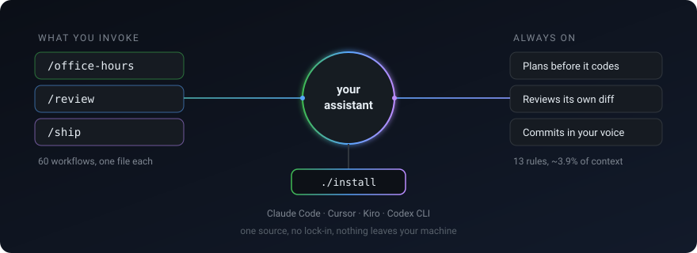
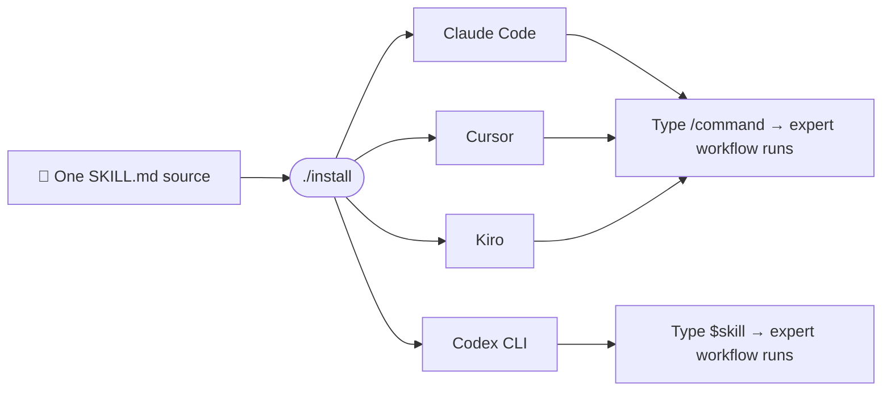

# vibestack

<p align="center">
  
</p>

<p align="center">
  <b>Give your AI coding assistant the habits of a senior engineering team.</b><br>
  One install. Slash commands that take you from a rough idea to a shipped, reviewed pull request.
</p>

<p align="center">
  <a href="https://github.com/timurgaleev/vibestack/releases"></a>
  <a href="LICENSE"></a>
  <a href="https://agentskills.io/specification"></a>
  <a href="https://github.com/timurgaleev/vibestack/stargazers"></a>
</p>

---

## What is this? (30-second version)

**If you use an AI coding assistant** (Claude Code, Cursor, Kiro, or Codex CLI),
vibestack adds a menu of expert workflows you trigger by name — `/` in Claude
Code, Cursor and Kiro, `$` in Codex. Instead of "write me some code," you get
`/office-hours` to shape the idea, `/review` to catch bugs, and `/ship` to open a
clean pull request — each one a structured, opinionated process, not a vague
prompt.

**For engineers:** 50+ portable `SKILL.md` workflows — planning, TDD, security
audit, cross-model review, debugging, release. Same source installs into Claude
Code, Cursor, Kiro, and Codex CLI. No lock-in, no telemetry, state stays in
`~/.vibestack/`.

> Think of it as turning a junior-level "just do it" assistant into one that
> plans, gets a second opinion, tests, and ships like a team would.

---

## Install in 30 seconds

```bash
git clone https://github.com/timurgaleev/vibestack ~/vibestack
~/vibestack/install
```

Clone anywhere **outside** an agent's skills directory. The installer renders the
skills into each agent's own folder; a checkout sitting inside one of those folders
gets indexed a second time, so every skill shows up twice in the picker.

**macOS needs a newer bash.** The installer uses associative arrays and refuses to
run on the bash 3.2 Apple still ships as `/bin/bash`. `brew install bash` is
enough — nothing else changes, and the skills themselves run fine on 3.2.

That's it. Open a new session of your agent and type `/office-hours`:

```
Before we dig in — what's your goal with this?

  Building a startup (or thinking about it)
  Hackathon / demo — time-boxed, need to impress
  Open source / research — building for a community
  Learning — teaching yourself to code, leveling up
```

Pick a mode and it walks you through the right questions, then saves a design
doc you can hand straight to `/plan-eng-review`. Every skill works like this —
guided, structured, no filler. If `/office-hours` clicks, the rest will too.

---

## Why people use it

- 🚀 **Idea → shipped, guided the whole way.** `/office-hours` → `/plan-eng-review` → `/tdd` → `/review` → `/ship`. The chain is built for you.
- 🧠 **A real second opinion.** Reviews run a cross-model check (a different AI) automatically, so two models have to agree before you ship.
- 🔒 **Yours, private.** No telemetry, no accounts, no cloud. Everything lives on your machine in `~/.vibestack/`.
- 🔁 **No lock-in.** One source installs into Claude Code, Cursor, Kiro, and Codex CLI alike. Switch tools, keep your workflow.
- 📋 **Copy, run, done.** Two commands to install, `git pull && ./install` to update. Plain bash, zero runtime dependencies.
- 🧰 **A real CLI.** `vibestack` on your PATH: `status`, `doctor`, `skills`, and every `vibe-*` tool from any directory — like any server-side CLI.

---

## How it works

One set of skill files installs into whichever agent you use:



Each skill is a plain `SKILL.md` file your agent discovers and exposes as a
`/command`. Install writes the file plus links to its helpers — so
`git pull && ./install` is the entire update story.

---

## A taste of the skills

53 skills across planning, shipping, QA, design, and security.
A few highlights:

| Command | What it does |
|---|---|
| `/office-hours` | Brainstorm an idea into a concrete design doc |
| `/plan-eng-review` | Pressure-test a plan — architecture, data, risk |
| `/tdd` | Test-driven development, red-green-refactor |
| `/review` | Pre-merge review — correctness, security, tests |
| `/ship` | Merge base, run tests, review, version bump, open the PR |
| `/investigate` | Systematic debugging — no fix without a confirmed root cause |
| `/cso` | Security audit — OWASP Top 10 + threat model |

👉 **Full list of every skill: [`docs/skills.md`](docs/skills.md)**

---

## More

```bash
./install --target=all      # Claude Code + Cursor + Kiro + Codex, non-interactive
./install --dry-run         # Preview every change, write nothing
git pull && ./install       # Update
~/vibestack/uninstall --target=all      # Remove
```

- [`docs/skills.md`](docs/skills.md) — all skills, with descriptions
- [`ETHOS.md`](ETHOS.md) — the five principles behind the design
- [`CONTRIBUTING.md`](CONTRIBUTING.md) — add your own skill in minutes
- [`docs/agent-skills-compatibility-audit.md`](docs/agent-skills-compatibility-audit.md) — per-agent behavior, incl. safety-hook tiers
- [`docs/internals.md`](docs/internals.md) — binaries, shared snippets, preamble flags, test suites, CI
- [`docs/external-tools.md`](docs/external-tools.md) — the few tools vibestack expects but does not bundle
- [`CHANGELOG.md`](CHANGELOG.md) · [`LICENSE`](LICENSE) (MIT)

> **Heads-up:** the safety skills (`/careful`, `/freeze`, `/guard`) enforce
> hard blocks on Claude Code. On Cursor/Kiro they fall back to a soft LLM
> nudge — details in the compatibility audit above.

---

<p align="center">
  If vibestack saves you time, <a href="https://github.com/timurgaleev/vibestack/stargazers">give it a ⭐</a> — it's the simplest way to say opinionated workflows beat ad-hoc prompting.
</p>
